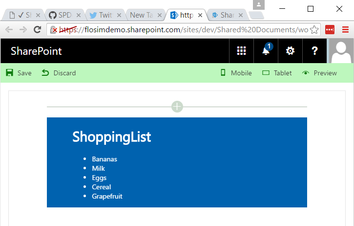
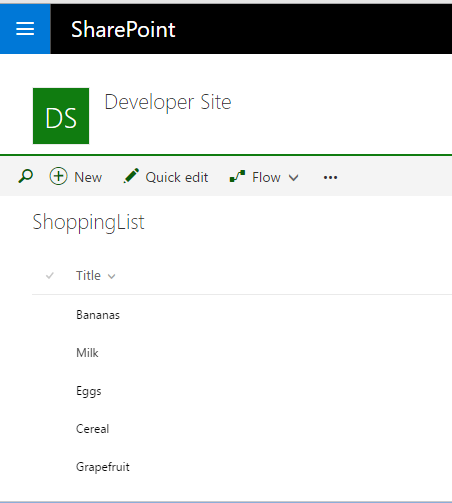
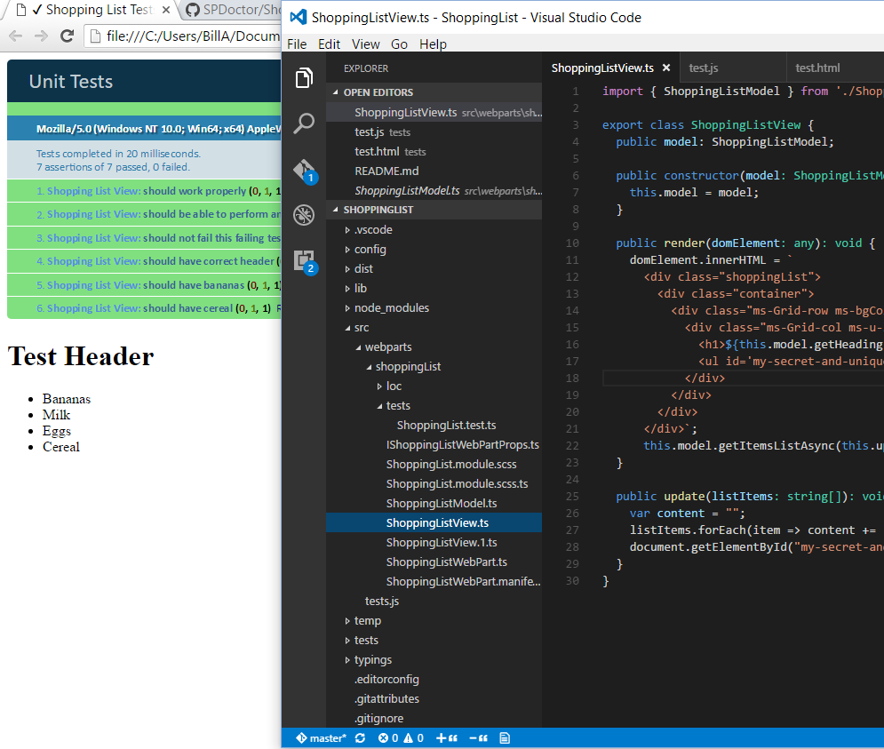

## Shopping List




This is a very simple client-side web part to demonstrate TDD (Test-driven Development)
for client-side code using the SharePoint Framework.
The web part renders the contents of a list called "ShoppingList" in the site.




If you want see the web part in your developer tenant you will need to provision the list and populate it.
If you just want to run the tests you don't need to provision anything, in fact the tests run entirely locally,
and do not require you to run *gulp serve*.

### Running the tests

The unit test code is in the directory *tests* at the top level, which contains a qunit test page and supporting files.
Open test.html in a browser to see the tests running.
There is a meta-refresh tag which will cause the test page to reload every five seconds.
Open Visual Studio Code (or your preferred editor) and adjust the windows size and location
so that you can see the test page running in the browser.
Now you can edit the source files and when you save them you will see a continuous
red/green state so that you know immediately when you have caused a regression,
or when you have successfully got your tests to pass.



Note that there is also some test code in the *src/webpart* directory,
but this is for integration tests and is part of the SharePoint Framework.

### Building the code

```bash
git clone https://github.com/SPDoctor/ShoppingList.git
npm install
npm install -g gulp
gulp serve
```

This package produces the following:

* lib/* commonjs components - this allows this package to be reused from other packages.
* dist/* - a single bundle containing the components used for uploading to a cdn pointing a registered Sharepoint webpart library to.
* temp/* a test page that hosts the components in this package.

